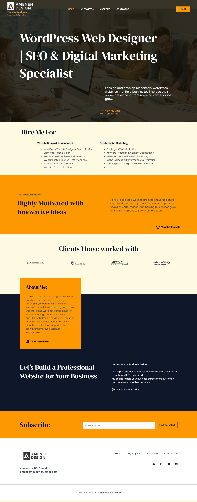
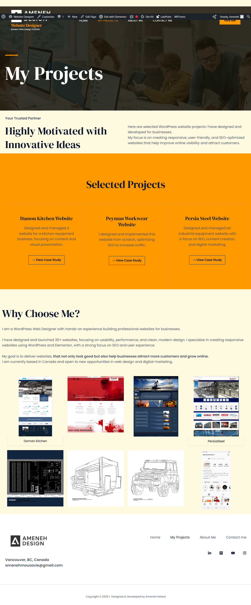
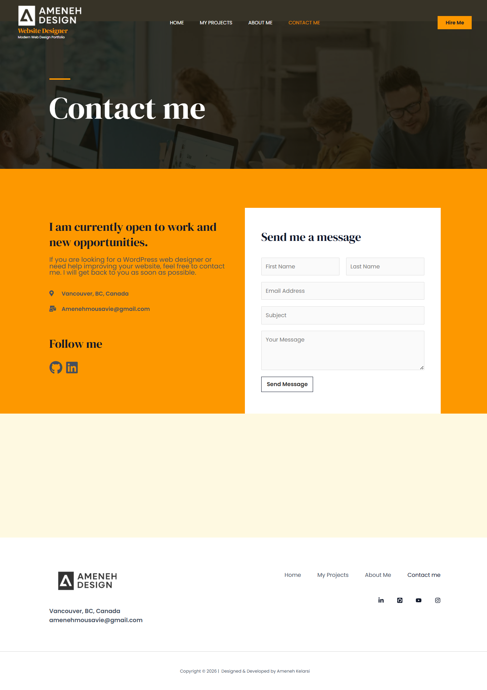

# 🌐 Ameneh Mousavi Portfolio

## 🔗 Live Website
[Visit Website](https://amenehdesign.com/)

## 📌 About This Project
This is my personal portfolio website built with WordPress.  
It showcases my web design projects, UI/UX skills, and digital marketing campaigns.  
Perfect for potential employers or clients to explore my work.

## ✨ Features
- Responsive Design (Desktop & Mobile)
- Modern UI/UX
- SEO Optimized
- Fast Loading
- Easy Navigation

## 🛠️ Technologies & Tools
- WordPress
- Elementor (WordPress page builder)
- SEO Plugins (for optimization)
- Google Analytics (tracking & reporting)
- HTML, CSS, JavaScript

## 📷 Screenshots

### Home Page

### Projects Page

### Contact Page

> 💡 Tip: Replace the filenames (`home-screenshot.png`, etc.) with the actual screenshot file names you upload in GitHub.

## 💼 Digital Marketing & Campaigns
- PDF Reports and Analytics (see `reports/` folder)
- Campaign screenshots and results
- SEO & Content Optimization

## 💡 What I Learned
- Building responsive layouts
- Improving UI/UX design
- Working effectively with WordPress themes and plugins
- SEO optimization and tracking marketing campaigns

## 👩‍💻 Author
**Ameneh Mousavi**  
Web Designer & Frontend Developer | WordPress | UI/UX | Digital Marketing  

---

## 📌 How to Explore
1. Click the [Live Website](https://amenehdesign.com/) to see the site in action  
2. Check the screenshots above to quickly see layout and design  
3. Browse `reports/` folder for PDFs on digital marketing campaigns  
4. Explore pinned repositories for detailed projects

---

## 📌 Topics (for GitHub search)
wordpress portfolio web-design frontend responsive ui-ux digital-marketing personal-website
