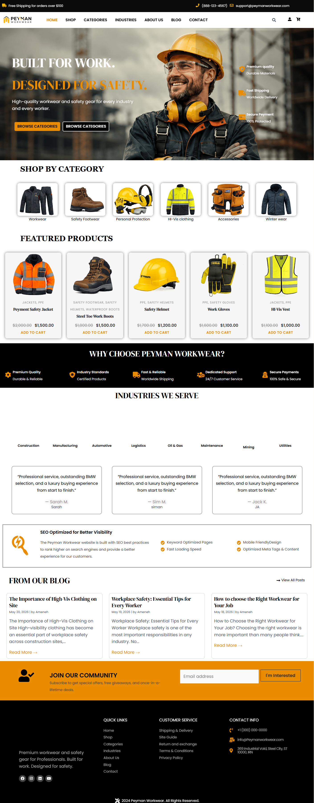

# 👋 Hi, I'm Ameneh Mousavi

WordPress Web Designer | UI/UX Designer | Front-End Enthusiast

I design and develop modern, responsive, and user-friendly websites using WordPress and Elementor.  
Focused on performance, clean UI, and business-oriented design.

---

## 🛠️ Skills

- WordPress Development
- Elementor Pro
- UI/UX Design
- Responsive Web Design
- SEO Optimization
- HTML / CSS
- Git & GitHub

---

## 🚀 Portfolio Projects

---

### 🟢 BMW Dealership Website

Designed and managed a BMW dealership website for Tyskhodro, focused on luxury vehicle presentation, customer engagement, and responsive web design.

---

### 🟣 Peyman Workwear Website 

)

Designed and built the website from scratch, including SEO optimization to improve search visibility and increase traffic.

---

### 🔵 Persia Steel Industrial Website Redesign

Redesigned and rebuilt as a professional industrial website to demonstrate WordPress, Elementor, responsive design, and business-oriented web strategy.

---

## 📈 About Me

I enjoy turning ideas into clean, functional, and modern websites.  
My focus is on user experience, performance, and creating digital products that help businesses grow.

---

## 📫 Contact

- Email: Amenehmousavie@gmail.com
- LinkedIn: https://www.linkedin.com/in/ameneh-mousavi-kelarsi/
- GitHub: https://github.com/amenehmousavi

---

⭐ Thank you for visiting my portfolio!
